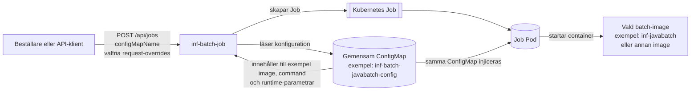
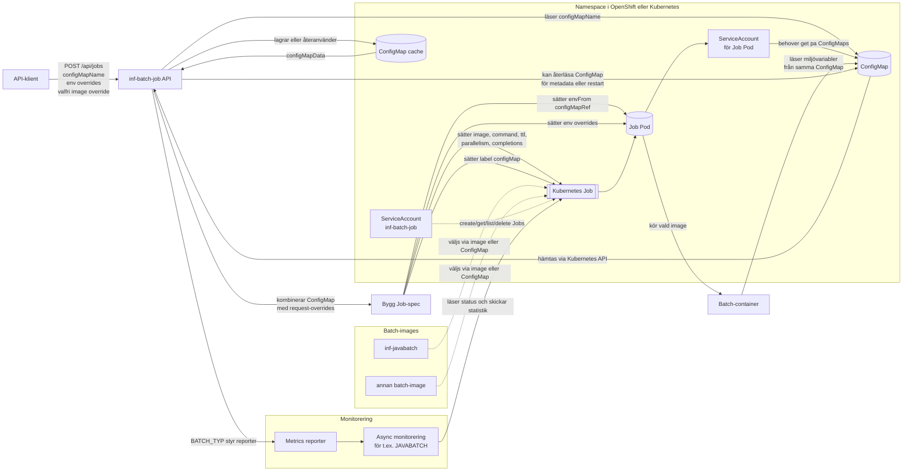
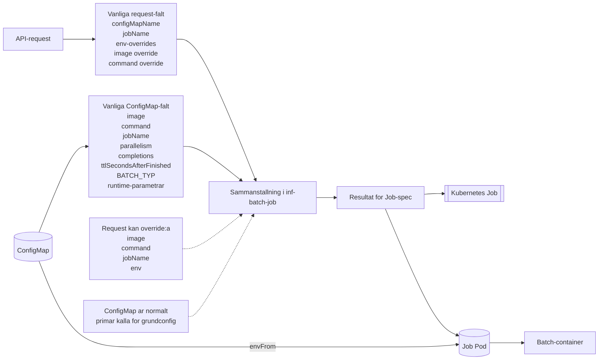

# Uppdaterat batchflöde

Detta dokument innehåller fyra versioner av samma flöde:

- en presentationsvänlig översikt
- en teknisk variant med RBAC, cache och monitorering
- en arkitekturvariant med tydlig ansvarsfördelning
- en fältvariant som visar vad som kommer från request respektive `ConfigMap`

## 1. Presentationsvänlig översikt

Det här diagrammet är avsett för verksamhetsdialog, presentationer och snabb onboarding.

### Tolkning

- `configMapName` är primär indata till `inf-batch-job`.
- `inf-batch-job` använder `ConfigMap` för att avgöra hur `Job` ska skapas.
- Den image som körs kan vara `inf-javabatch`, men även andra batch-images.
- Samma `ConfigMap` används både av `inf-batch-job` och av den startade batch-containern.

## 2. Teknisk variant

Det här diagrammet visar implementationen mer detaljerat, inklusive cache, RBAC och monitorering.

### Teknisk tolkning

- `inf-batch-job` läser `ConfigMap` via Kubernetes API och cachar resultatet.
- `Job` byggs från `ConfigMap` plus eventuella request-overrides.
- `image` kan komma från requesten eller från `ConfigMap`.
- `Job`-podden får `envFrom` med samma `ConfigMap`, så batch-containern läser samma värden vid runtime.
- `ServiceAccount` för själva `Job`-podden behöver rätt att läsa `ConfigMaps`.
- `BATCH_TYP` kan styra vilken monitorering eller rapportering som aktiveras.

## 3. Arkitekturreview med ansvarsfördelning

Det här diagrammet gör det tydligt vad som är orkestrering, vad som är plattform och vad som är batch-applikationens eget ansvar.

```mermaid
flowchart LR
    caller[Anropare] -->|jobName\nconfigMapName\nrequest-overrides| ibj

    subgraph orchestrator[Ansvar: inf-batch-job]
        ibj[inf-batch-job]
        readcm[Läser ConfigMap och tolkar job-config]
        buildjob[Bygger Kubernetes Job-spec]
        monitor[Initierar monitorering\nvid behov]
    end

    subgraph platform[Ansvar: Kubernetes eller OpenShift]
        cm[(ConfigMap)]
        job[[Kubernetes Job]]
        pod[(Job Pod)]
    end

    subgraph app[Ansvar: batch-image]
        image[Vald image\nexempel: inf-javabatch\neller annan batch-image]
        appcfg[Läser runtime-parametrar\nfrån miljövariabler]
        execute[Kör batchlogik]
        report[Rapporterar status eller resultat\nenligt batchtyp]
    end

    ibj --> readcm
    readcm -->|hämtar configMapData| cm
    cm -->|image, command, BATCH_TYP,\nruntime-parametrar| readcm
    readcm --> buildjob
    buildjob -->|skapar Job med image, command,\nlabels, envFrom och overrides| job
    job --> pod
    pod -->|startar vald image| image

    cm -->|samma ConfigMap exponeras\ntill podden| pod
    image --> appcfg
    appcfg --> execute
    execute --> report

    ibj --> monitor
    monitor -. observerar Job och status .-> job

    classDef orch fill:#d9ecff,stroke:#2b6cb0,color:#102a43;
    classDef plat fill:#e6fffa,stroke:#2f855a,color:#123c2f;
    classDef appl fill:#fff7e6,stroke:#b7791f,color:#5f370e;

    class ibj,readcm,buildjob,monitor orch;
    class cm,job,pod platform;
    class image,appcfg,execute,report appl;
```

### Ansvar per del

- `inf-batch-job` ansvarar för att tolka requesten, läsa `ConfigMap`, bygga `Job` och initiera eventuell monitorering.
- Kubernetes eller OpenShift ansvarar för att köra `Job`, skapa podden och exponera `ConfigMap` till containern.
- batch-imagen ansvarar för att läsa sina runtime-parametrar och köra själva batchlogiken.
- batch-imagen behöver inte veta hur `Job` skapades, bara att rätt miljövariabler finns tillgängliga.
- `inf-batch-job` ska inte bära batchlogik för specifika images, utan bara orkestrera och komplettera med gemensam monitorering.

## 4. Fält från request respektive ConfigMap

Det här diagrammet visar vilka delar som typiskt kommer från API-requesten respektive från `ConfigMap`, och vilka värden som kan override:as.

### Fälttolkning

- `configMapName` kommer från requesten och används för att slå upp rätt `ConfigMap`.
- Grundkonfiguration som `image`, `command`, `parallelism`, `completions`, `ttlSecondsAfterFinished` och `BATCH_TYP` kommer normalt från `ConfigMap`.
- Requesten kan override:a till exempel `image`, `command`, `jobName` och extra `env`.
- Batch-containern får fortfarande samma `ConfigMap` vid runtime, även om vissa fält har override:ats i `Job`-specen.