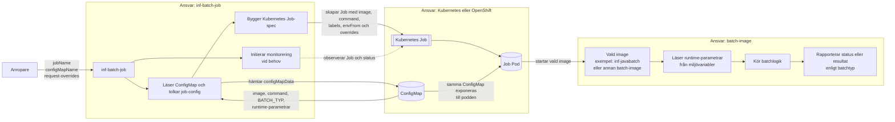

# ConfigMap Support i inf-batch-job

## Översikt

inf-batch-job kan nu referera till ConfigMaps som skapats av batch-applikationer. Detta separerar konfigurationsansvar:

- **Batch-applikationer** (t.ex. inf-batch-testapp1): Skapar och äger sina egna ConfigMaps
- **inf-batch-job**: Läser configMapName från API-request och länkar ConfigMap till Kubernetes Job

## Arkitektur

```

För fler varianter av samma flöde, se [batch-poc/BATCH-FLOW-DIAGRAM.md](batch-poc/BATCH-FLOW-DIAGRAM.md).

### Arkitekturreview med ansvarsfördelning

Det här diagrammet visar ansvarsfördelningen mellan `inf-batch-job`, plattformen och själva batch-imagen.


┌──────────────────────┐
│ inf-batch-testapp1   │
├──────────────────────┤
│ • Container Image    │
│ • ConfigMap (yaml)   │
│ • Deployment docs    │
└──────────────────────┘
          │
          ▼
┌──────────────────────┐
│ ConfigMap deployad   │
│ i OpenShift          │
│ namespace (dev252)   │
└──────────────────────┘
          │
          ▼
┌──────────────────────┐
│ inf-batch-job API    │
│ Tar emot:            │
│ • image              │
│ • configMapName      │
└──────────────────────┘
          │
          ▼
┌──────────────────────┐
│ Kubernetes Job       │
│ med envFrom ref      │
│ till ConfigMap       │
└──────────────────────┘
```

## API Användning

### Request med ConfigMap

```json
{
  "jobName": "test-batch-1",
  "image": "image-registry.openshift-image-registry.svc:5000/dev252/inf-batch-testapp1:latest",
  "configMapName": "inf-batch-testapp1-config"
}
```

### Kombinera ConfigMap + Extra Env Vars

```json
{
  "jobName": "test-batch-1",
  "image": "...",
  "configMapName": "inf-batch-testapp1-config",
  "env": {
    "RUN_ID": "batch-20260312-001",
    "OVERRIDE_PARAMETER": "special-value"
  }
}
```

ConfigMap-värden laddas först, sedan överskrids av `env`-parametrar vid namnkonflikter.

## BATCH_TYP for rapportering

Lagg till `BATCH_TYP` i ConfigMap for att styra hur inf-batch-job rapporterar statistik/status.

- `BATCH_TYP=JAVABATCH`: rapportering sker enligt samma modell som i `monitor_jbatch`-scriptet (tidigare `monitor.py`).
- Andra typer eller tomt varde: ingen rapportering just nu.

Exempel:

```yaml
data:
  image: "image-registry.openshift-image-registry.svc:5000/dev252/inf-batch-javabatch:latest"
  configMapName: "inf-batch-javabatch-config"
  BATCH_TYP: "JAVABATCH"
```

### Parametrisera action och job args for javabatch

Anvand `env`-overrides i API-anrop:

```json
{
  "configMapName": "inf-batch-javabatch-config",
  "env": {
    "JOB_ACTION": "restart",
    "JOB_ARGS": "myJob=true"
  }
}
```

Detta gor att batch-poc skapar ett separat Kubernetes Job-objekt for script-imagen med runtime-parametrar.

## RBAC Krav

inf-batch-job behöver läsbehörighet till `ConfigMaps` i den nuvarande implementationen, eftersom:

1. **inf-batch-job läser ConfigMap vid jobbstart** för att bygga `Job`-specen
2. **Kubernetes Job läser samma ConfigMap vid runtime** via `envFrom`
3. **Både inf-batch-job och Job Podens ServiceAccount behöver därför rättigheter**

### Rekommenderad RBAC Setup

#### För inf-batch-job (ServiceAccount: inf-batch-job)

Behöver rättigheter att skapa och läsa `Jobs`, samt läsa `ConfigMaps`:

```yaml
apiVersion: rbac.authorization.k8s.io/v1
kind: Role
metadata:
  name: inf-batch-job-role
  namespace: dev252
rules:
- apiGroups: ["batch"]
  resources: ["jobs"]
  verbs: ["create", "get", "list", "delete"]
- apiGroups: [""]
  resources: ["configmaps"]
  verbs: ["get", "list"]
- apiGroups: [""]
  resources: ["pods"]
  verbs: ["get", "list"]
- apiGroups: [""]
  resources: ["pods/log"]
  verbs: ["get"]
```

#### För Batch Jobs (ServiceAccount: default eller custom)

Jobs som startas behöver också läsrättigheter till `ConfigMaps`, eftersom batch-containern läser samma värden vid runtime:

```yaml
apiVersion: rbac.authorization.k8s.io/v1
kind: Role
metadata:
  name: batch-job-role
  namespace: dev252
rules:
- apiGroups: [""]
  resources: ["configmaps"]
  verbs: ["get", "list"]
```

```yaml
apiVersion: rbac.authorization.k8s.io/v1
kind: RoleBinding
metadata:
  name: batch-job-rolebinding
  namespace: dev252
subjects:
- kind: ServiceAccount
  name: default  # eller en dedicated ServiceAccount
  namespace: dev252
roleRef:
  kind: Role
  name: batch-job-role
  apiGroup: rbac.authorization.k8s.io
```

### Alternativ: Custom ServiceAccount för Jobs

Om ni vill ha dedikerad ServiceAccount för batch jobs:

```yaml
apiVersion: v1
kind: ServiceAccount
metadata:
  name: batch-job-sa
  namespace: dev252
```

Uppdatera då inf-batch-job för att sätta serviceAccountName i Job Pod spec.

## Hantering av ConfigMaps per Batch-App

### Exempel: inf-batch-testapp1

1. **Skapa ConfigMap-fil**: `inf-batch-testapp1/configmap.yaml`

```yaml
apiVersion: v1
kind: ConfigMap
metadata:
  name: inf-batch-testapp1-config
  namespace: dev252
data:
  BATCH_SIZE: "100"
  LOG_LEVEL: "INFO"
```

2. **Deploya ConfigMap**:
```powershell
oc apply -f configmap.yaml -n dev252
```

3. **Referera i API-anrop**:
```json
{
  "jobName": "testapp1-run",
  "image": "...",
  "configMapName": "inf-batch-testapp1-config"
}
```

### Exempel: inf-batch-testapp2 (framtida)

```yaml
apiVersion: v1
kind: ConfigMap
metadata:
  name: inf-batch-testapp2-config
  namespace: dev252
data:
  DATABASE_URL: "jdbc:postgresql://..."
  INTEGRATION_ENDPOINT: "http://..."
```

## Fördelar med denna Arkitektur

1. **Separation of Concerns**: Varje batch-app äger sin konfiguration
2. **Versionskontroll**: ConfigMaps kan versionshanteras med applikationskod
3. **Återanvändbarhet**: Samma ConfigMap för flera jobbkörningar
4. **Flexibilitet**: Kombinera ConfigMap (grund-config) + env vars (runtime overrides)
5. **Security**: Batch-apps kan inte se varandras ConfigMaps (med RBAC)

## Uppdatering av ConfigMaps

```powershell
# Redigera ConfigMap direkt
oc edit configmap inf-batch-testapp1-config -n dev252

# Eller applicera uppdaterad fil
oc apply -f configmap.yaml -n dev252

# Verifiera ändringar
oc describe configmap inf-batch-testapp1-config -n dev252
```

**OBS**: Ändrade ConfigMaps påverkar INTE redan körande Jobs. Nya Jobs plockar upp nya värden.

## Troubleshooting

### Job startar inte - "ConfigMap not found"

```powershell
# Kontrollera att ConfigMap finns
oc get configmap inf-batch-testapp1-config -n dev252

# Kontrollera Job events
oc describe job <job-name> -n dev252
```

**Lösning**: Deploya ConfigMap med `oc apply -f configmap.yaml`

### Job kan inte läsa ConfigMap

```powershell
# Kontrollera Pod events
oc get pods -n dev252
oc describe pod <pod-name> -n dev252
```

**Lösning**: Verifiera RBAC - ServiceAccount behöver `get` på ConfigMaps.

### Fel värden i miljövariabler

```powershell
# Inspektera Pod environment
oc get pod <pod-name> -n dev252 -o jsonpath='{.spec.containers[0].env}'
oc get pod <pod-name> -n dev252 -o jsonpath='{.spec.containers[0].envFrom}'
```

**Lösning**: Kontrollera ConfigMap-innehåll och att rätt configMapName skickas i API-request.

## Best Practices

1. **Naming Convention**: `<app-name>-config` (t.ex. `inf-batch-testapp1-config`)
2. **Namespace Scoping**: Deploya ConfigMaps i samma namespace som Jobs körs
3. **Versioning**: Överväg att lägga till version i metadata labels
4. **Documentation**: Dokumentera alla ConfigMap-nycklar i batch-app's README
5. **Validering**: Batch-appen bör validera att alla required env vars finns vid start
